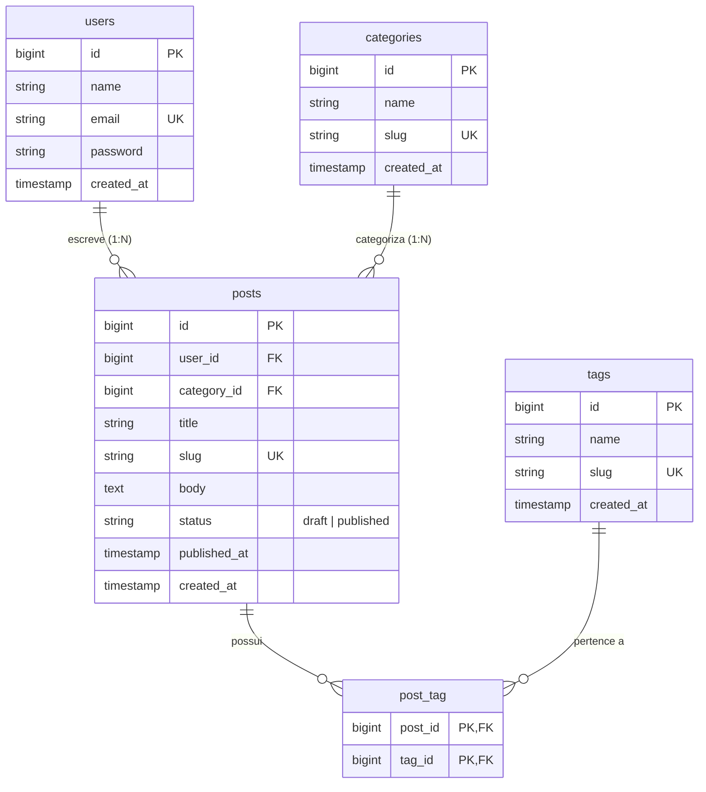

# Registro de Decisões de Arquitetura (ADRs)

Este documento registra as principais decisões de design técnico, seus contextos e os trade-offs envolvidos.

---

## ADR 001: Separação de Infraestrutura e Código da Aplicação

* **Status:** Aprovado / Implementado
* **Data:** 2026-10-06

### Contexto
Precisamos estruturar o repositório antes de instalar o Laravel para garantir que os arquivos de infraestrutura (Dockerfile, configurações do Nginx, scripts de inicialização) não fiquem misturados na raiz com os arquivos da aplicação.

### Decisão
Criamos a pasta `docker/` na raiz para guardar subpastas de serviços (`docker/nginx`, `docker/php`) e a pasta `src/` para abrigar a aplicação web montada no container em `/var/www`.

### Consequências e Trade-offs
* **Vantagens:** Raiz limpa; fácil manutenção; separação clara de responsabilidades (DevOps vs Aplicação).
* **Desvantagens:** Requer atenção no mapeamento de caminhos relativos no `docker-compose.yml`.

---

## ADR 002: Nginx como Servidor Web e Proxy Reverso com Alpine Linux

* **Status:** Aprovado / Implementado
* **Data:** 2026-10-06

### Contexto
Necessidade de expor o projeto na porta 80, gerenciar arquivos estáticos com alta performance e repassar scripts dinâmicos para o PHP-FPM via FastCGI.

### Decisão
Utilizar a imagem oficial `nginx:alpine` e injetar a configuração do site através de um bind mount em `/etc/nginx/conf.d/default.conf`.

### Consequências e Trade-offs
* **Vantagens:** Consumo mínimo de memória e CPU (~5-10MB RAM); suporte nativo a FastCGI de alto rendimento.
* **Desvantagens:** O Nginx não processa scripts PHP sozinho, exigindo um container separado para o PHP-FPM.

---

## ADR 003: Imagem Customizada PHP-FPM (Alpine) com Multi-Stage Composer

* **Status:** Aprovado / Implementado
* **Data:** 2026-10-07

### Contexto
O Laravel exige extensões PHP específicas que não acompanham a imagem oficial padrão (`php:alpine`), como `pdo_pgsql` para suporte ao PostgreSQL e `gd` para manipulação de mídias. Além disso, precisamos do Composer disponível para instalação de dependências.

### Decisão
Criar um `Dockerfile` customizado em `docker/php/Dockerfile` baseado em `php:8.3-fpm-alpine`, instalando as extensões via `docker-php-ext-install` e copiando o binário do Composer via Multi-stage build (`COPY --from=composer:latest`).

### Consequências e Trade-offs
* **Vantagens:** Ambiente de desenvolvimento 100% idêntico entre colaboradores; extensões necessárias pré-compiladas; presença do Composer sem poluir a máquina host.
* **Desvantagens:** O primeiro build (`docker compose up --build`) demora um pouco mais devido à compilação das extensões do PHP no Alpine.

---

## ADR 004: PostgreSQL 16 com Volume Nomeado para Persistência e Segurança de Credenciais via `.env`

* **Status:** Aprovado / Implementado
* **Data:** 2026-10-08

### Contexto
Precisamos de um banco de dados relacional robusto para o blog/portfólio. Os dados não podem ser perdidos quando os containers forem encerrados (`docker compose down`) e as credenciais de acesso não devem ser expostas diretamente no controle de versão (`docker-compose.yml`).

### Decisão
1. Adotar a imagem oficial `postgres:16-alpine` fixando a versão estável.
2. Utilizar um volume nomeado (`postgres_data`) com driver `local` mapeado em `/var/lib/postgresql/data` para máxima performance de I/O no WSL2 e isolamento contra corrupção de arquivos.
3. Injetar variáveis de ambiente a partir do arquivo local `.env` (`POSTGRES_DB`, `POSTGRES_USER`, `POSTGRES_PASSWORD`).

### Consequências e Trade-offs
* **Vantagens:** Alta performance no WSL2/Linux; persistência de dados garantida entre reinicializações do Docker; conformidade com boas práticas de segurança OWASP (secrets fora do Git).
* **Desvantagens:** Alterações posteriores nas credenciais do `.env` exigem o reset manual do volume nomeado (`docker compose down -v`), pois o script de entrada do Postgres só processa credenciais em volumes novos/vazios.

---

## ADR 005: Redis 7 para Cache In-Memory e Instalação de Extensão via PECL com Otimização de Camadas Docker

* **Status:** Aprovado / Implementado
* **Data:** 2026-10-08

### Contexto
Para acelerar o tempo de resposta do blog e gerenciar sessões/queues sem onerar o banco PostgreSQL, precisamos de uma solução in-memory. Além disso, a instalação de extensões de terceiros via PECL no Alpine exige ferramentas de compilação C (`$PHPIZE_DEPS`).

### Decisão
1. Adicionar o container `redis:7-alpine` na porta `6379`.
2. Instalar a extensão nativa do `redis` no PHP via `pecl install redis && docker-php-ext-enable redis`.
3. Unificar a instalação de pacotes `$PHPIZE_DEPS`, extensões nativas e PECL em uma única instrução `RUN` encadeada com `&&` no `Dockerfile`.

### Consequências e Trade-offs
* **Vantagens:** Otimização drasticamente do tamanho da imagem Docker gerando menos camadas (*layers*); leitura de dados em microsegundos via memória RAM; suporte nativo no Laravel.
* **Desvantagens:** Como não mapeamos volume no Redis nesta etapa, dados de cache na memória somem se o container for destruído (comportamento desejável para cache em dev).

---

## ADR 006: Instalação Limpa do Laravel 11/12/13, Roteamento Nginx (Front Controller) e Modelo de Permissões (Dev vs Prod)

* **Status:** Aprovado / Implementado
* **Data:** 2026-10-08

### Contexto
Precisamos instalar o framework Laravel sem depender de ferramentas instaladas na máquina host, garantir o isolamento da raiz pública (`public/`) no Nginx e resolver as permissões de escrita de cache/log (`storage/` e `bootstrap/cache/`).

### Decisão
1. **Instalação via Container:** Executar o `composer create-project` através do `docker compose exec app`.
2. **Exposição Segura no Nginx:** Alterar o `root` do Nginx para `/var/www/public` (protegendo `.env` e código do servidor) e adotar a diretiva `try_files $uri $uri/ /index.php?$query_string;` (Front Controller Pattern).
3. **Estratégia de Permissões de Escrita:**
   - **Desenvolvimento Local:** Uso do `chmod -R 777 src/storage src/bootstrap/cache` para evitar bloqueios de I/O em *bind mounts* entre o sistema do host e o container.
   - **Produção (OWASP Security Standard):** Proibido uso de `777`. Utilizar atribuição do usuário do sistema `chown -R www-data:www-data` combinado com permissões restritas `775`/`755`.

### Consequências e Trade-offs
* **Vantagens:** Proteção total dos arquivos sensíveis contra acessos HTTP diretos; flexibilidade de rotas controladas pelo Laravel; agilidade no desenvolvimento local.
* **Desvantagens:** Exige conscientização do time sobre a diferença de comandos de permissão entre ambientes (dev `chmod` vs prod `chown`).

---

## ADR 007: Resolução de Nomes por DNS do Docker para Conexão Laravel-PostgreSQL e Execução de Migrations via CLI

* **Status:** Aprovado / Implementado
* **Data:** 2026-10-08

### Contexto
O Laravel dentro do container PHP precisa se comunicar com a instância do PostgreSQL 16 para executar as migrations de banco de dados.

### Decisão
1. Definir a variável `DB_HOST=db` no `src/.env`, aproveitando a resolução automática de nomes por DNS fornecida pelo driver `bridge` do Docker Compose.
2. Executar os comandos do Artisan diretamente via ponte do Docker Compose (`docker compose exec app php artisan migrate`).

### Consequências e Trade-offs
* **Vantagens:** Comunicação 100% isolada e segura pela rede interna `blog-network`; eliminação da necessidade de expor o IP público ou `localhost` interno do container.
* **Desvantagens:** Comandos do Artisan exigem a sintaxe `docker compose exec app` (mitigado pelo uso de alias no terminal).

---

## ADR 008: Modelo Entidade-Relacionamento (DER) para o Blog e Convenções de Tabelas Pivô N:N

* **Status:** Aprovado / Implementado
* **Data:** 2026-10-08

### Contexto
Precisamos projetar as entidades fundamentais da aplicação (`users`, `posts`, `categories`, `tags`), definindo suas chaves primárias, estrangeiras e o relacionamento N:N (Muitos para Muitos) entre postagens e etiquetas.

### Decisão
1. **Relacionamentos 1:N:** Adicionar as FKs `user_id` e `category_id` na tabela `posts` (lado N da relação).
2. **Relacionamento N:N:** Criar a tabela intermediária (pivot) denominada **`post_tag`**, seguindo a convenção oficial do Laravel (nomes das entidades no singular, em ordem alfabética, unidos por underline).
3. **Diagrama Mermaid (DER):**

### Consequências e Trade-offs
* **Vantagens:** Normalização até a 3ª Forma Normal (3FN); facilidade de consulta com Eloquent ORM (`$post->tags()`); integridade referencial mantida via PostgreSQL.
* **Desvantagens:** Exige criação de migration específica para a tabela pivô `post_tag`.

---

## ADR 009: Schema das Migrations do Blog com Restrições de Integridade e Chaves Primárias Compostas

* **Status:** Aprovado / Implementado
* **Data:** 2026-10-08

### Contexto
Precisamos implementar as migrations no Laravel para a criação física das tabelas no PostgreSQL (`categories`, `posts`, `tags`, `post_tag`), aplicando regras rígidas de validação e integridade de dados direto no banco de dados.

### Decisão
1. **Integridade Referencial:** Aplicar `->constrained()->cascadeOnDelete()` em todas as chaves estrangeiras (`user_id`, `category_id`, `post_id`, `tag_id`), garantindo exclusão em cascata se um registro pai for removido.
2. **Campos Únicos & Indexados:** Aplicar `->unique()` em todas as colunas `slug` para acelerar buscas e proibir duplicatas nas URLs.
3. **Chave Primária Composta Pivô:** Definir `$table->primary(['post_id', 'tag_id']);` na tabela `post_tag` para otimizar espaço de armazenamento e impedir vinculações duplicadas da mesma tag no mesmo post.
4. **Estado Padrão de Publicação:** Utilizar `$table->string('status')->default('draft')` prevenindo que posts não finalizados fiquem públicos acidentalmente.

### Consequências e Trade-offs
* **Vantagens:** Máxima consistência e velocidade de consulta no PostgreSQL; eliminação de registros órfãos por exclusão em cascata.
* **Desvantagens:** Ordem estrita de execução das migrations (a tabela `posts` precisa rodar após `users` e `categories` por conta das FKs).

---

## ADR 010: Geração de Dados Fictícios com Factories (Faker) e Associação Automática em Seeders N:N

* **Status:** Aprovado / Implementado
* **Data:** 2026-10-08

### Contexto
Precisamos de um ambiente de desenvolvimento populado com dados realistas para testar consultas, paginações e relacionamentos entre postagens, autores, categorias e etiquetas sem cadastrar manualmente dados no banco.

### Decisão
1. **Factories Otimizadas:** Utilizar a biblioteca `fake()` combinada com `Str::slug()` para simular títulos, slugs únicos e parágrafos de texto.
2. **Declaração de Relacionamento Eloquent N:N:** Adicionar o método `belongsToMany(Tag::class)` na Model `Post.php`.
3. **Povoamento Encadeado em Seeder:** Estruturar o `DatabaseSeeder.php` para criar registros pais (`categories`, `tags`, `users`) e encadear a criação de 20 posts atribuindo aleatoriamente chaves estrangeiras e relacionamentos de tags pivô via `$post->tags()->attach()`.

### Consequências e Trade-offs
* **Vantagens:** População de dados instantânea e reproduzível com um único comando (`php artisan db:seed`); validação prática da tabela pivô `post_tag` no PostgreSQL.
* **Desvantagens:** Exige manutenção das Factories caso o esquema de colunas da migration mude no futuro.

---

## ADR 011: Estratégia de Cache-Aside (In-Memory) no Redis com Serialização de Arrays Puros (`->toArray()`) e Mapeamento de Databases

* **Status:** Aprovado / Implementado
* **Data:** 2026-10-09

### Contexto
Consultar repetidamente coleções complexas do Eloquent com Eager Loading (`Post::with(['category', 'tags'])`) diretamente no PostgreSQL gera overhead desnecessário de I/O em disco. Precisamos de uma estratégia de cache in-memory usando o Redis que seja rápida, neutra e sem erros de serialização de objetos PHP (`unserialize()`).

### Decisão
1. **Padrão Cache-Aside (`Cache::remember`):** Tentar primeiro buscar a chave na RAM do Redis. Caso não exista, executar a consulta SQL no PostgreSQL e armazenar no Redis.
2. **Serialização em Array Puro (`->toArray()`):** Converter a `Eloquent\Collection` para array puro antes de persistir no Redis, evitando falhas de deserialização do driver nativo `phpredis` e reduzindo o consumo de memória em 3x.
3. **Mapeamento por Banco Lógico (`db1`):** Compreender que o Laravel isola a camada de Cache na **Database 1 (`db1`)** do Redis por padrão (acessível no terminal via `redis-cli -n 1 keys "*"`), separando o cache das filas e sessões.

### Consequências e Trade-offs
* **Vantagens:** Queda vertiginosa do tempo de resposta da aplicação (de **14.71 ms** no banco para **1.54 ms** na RAM); isolamento lógico de dados no Redis.
* **Desvantagens:** Exige a conversão explícita para Array ou Data Transfer Objects (DTOs) ao ler dados cacheados em vez de manipular instâncias vivas do Eloquent Model.

---

## ADR 012: Adoção do Livewire 3 para Frontend Reativo sem Desacoplamento de SPA

* **Status:** Aprovado / Implementado
* **Data:** 2026-10-09

### Contexto
Precisamos construir uma interface de usuário moderna e reativa para o Blog (com busca em tempo real e filtros sem recarregar a página), sem introduzir a complexidade de manter um projeto separado em React/Vue com autenticação via tokens JWT/Sanctum.

### Decisão
1. **Adotar o Livewire 3:** Utilizar o framework reativo do ecossistema Laravel que permite escrever componentes frontend orientados a eventos usando apenas PHP e templates Blade.
2. **Layout Base Centralizado:** Criar a estrutura em `resources/views/layouts/app.blade.php` incluindo Tailwind CSS e as diretivas `@livewireStyles` / `@livewireScripts`.

### Consequências e Trade-offs
* **Vantagens:** Produtividade extrema; zero necessidade de criar APIs REST / rotas duplicadas; SEO amigável com renderização inicial no servidor; reatividade em tempo real via AJAX/WebSockets transparentes.
* **Desvantagens:** Cada interação reativa realiza pequenas requisições HTTP para o backend (mitigado pelo nosso uso de cache no Redis).

---

## ADR 013: Implementação do Service Pattern (`PostService`) para Desacoplamento da Camada de Dados e Cache

* **Status:** Aprovado / Implementado
* **Data:** 2026-10-09

### Contexto
Para evitar o antipadrão de "Controllers Gordos" ou componentes UI sobrecarregados de responsabilidades no Livewire, precisamos isolar as regras de consulta SQL (PostgreSQL), busca in-memory (Redis) e expurgo de cache em uma camada dedicada.

### Decisão
1. **Criar a classe `App\Services\PostService`:** Centralizar a lógica de busca de posts publicados e gerenciamento de cache.
2. **Encapsulamento de Cache:** O método `getPublishedPosts()` encapsula a estratégia de Cache-Aside (`Cache::remember`), garantindo que nem o Controller nem o Livewire precisem saber como o banco ou o Redis funcionam por baixo dos panos.
3. **Invalidação de Cache Centralizada:** O método `clearPostCache()` isola a lógica de expurgo do Redis.

### Consequências e Trade-offs
* **Vantagens:** Separação clara de responsabilidades (SoC); reutilização do mesmo Service por múltiplos componentes ou APIs; alta testabilidade com mocks em testes unitários.
* **Desvantagens:** Introdução de uma nova camada de abstração que exige disciplina do time para não ignorar a Service acessando Models diretamente no frontend.

---

## ADR 014: Componentização Reativa com Livewire 3 (Debounce, Paginação Reativa e Buscas Case-Insensitive no PostgreSQL)

* **Status:** Aprovado / Implementado
* **Data:** 2026-10-09

### Contexto
Precisamos permitir que os visitantes do blog filtrem artigos por categorias e façam buscas por palavras-chave em tempo real, sem recarregar a página e sem gerar um volume excessivo de requisições ao servidor.

### Decisão
1. **Componente de Tela Cheia (`App\Livewire\PostList`):** Utilizar a trait `WithPagination` para gerenciar a paginação sem reloads e registrar o componente como rota principal.
2. **Debounce em Busca Reativa (`wire:model.live.debounce.300ms`):** Aplicar um atraso intencional de 300ms na digitação para evitar disparos de AJAX desnecessários a cada tecla digitada.
3. **Cláusula `ILIKE` no PostgreSQL:** Utilizar a instrução `where('title', 'ilike', ...)` na query do Eloquent para realizar buscas insensíveis a maiúsculas e minúsculas no banco relacional.

### Consequências e Trade-offs
* **Vantagens:** Redução de até 80% do tráfego de requisições no servidor graças ao debounce; experiência de usuário (UX) fluida de SPA mantendo o código 100% em PHP; buscas precisas no PostgreSQL.
* **Desvantagens:** Necessidade de resetar a página (`$this->resetPage()`) ao alterar filtros para evitar a exibição de resultados vazios em páginas superiores.

---

## ADR 015: Componente de Leitura de Artigos (`PostDetail`), Implicit Model Binding por Slug e Rotas Nomeadas

* **Status:** Aprovado / Implementado
* **Data:** 2026-10-09

### Contexto
Precisamos exibir o conteúdo completo dos artigos de forma segura, com URLs amigáveis e otimizadas para SEO (usando `slug` em vez de IDs numéricos), mantendo a manutenção de links desacoplada das URLs físicas.

### Decisão
1. **Implicit Model Binding por Slug:** Capturar o parâmetro `{slug}` no método `mount(string $slug)` do componente `App\Livewire\PostDetail`, executando `Post::where('slug', $slug)->firstOrFail()`.
2. **Rotas Nomeadas (`route('post.detail', ...)`):** Registrar a rota com o nome `post.detail` para desacoplar a geração de links no Blade dos caminhos de URL físicos da aplicação.
3. **Garantia de 404 e Segurança:** O uso do `firstOrFail()` garante a devida resposta HTTP 404 em caso de requisições a artigos inexistentes ou em rascunho.

### Consequências e Trade-offs
* **Vantagens:** URLs otimizadas para mecanismos de busca (SEO); facilidade de alteração de URLs globais sem quebrar os links das views; tratamento automático de exceções 404.
* **Desvantagens:** Exige indexação prévia com chave `unique()` no banco de dados para evitar ambiguidades de busca por slug.

